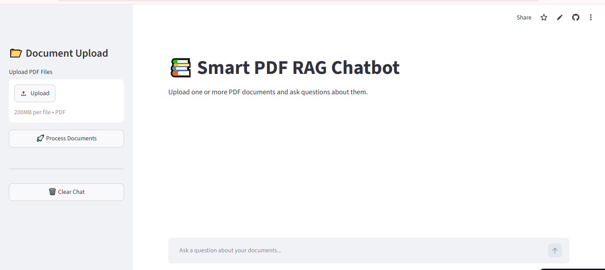
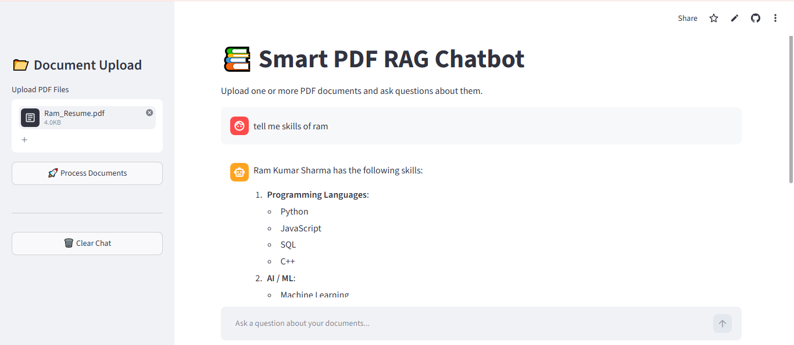
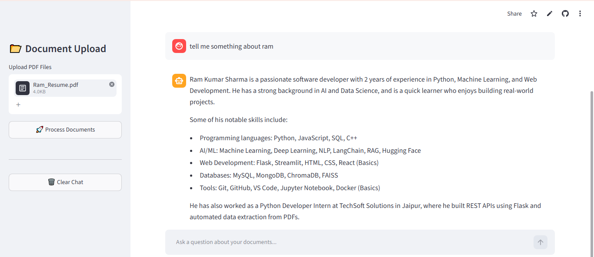
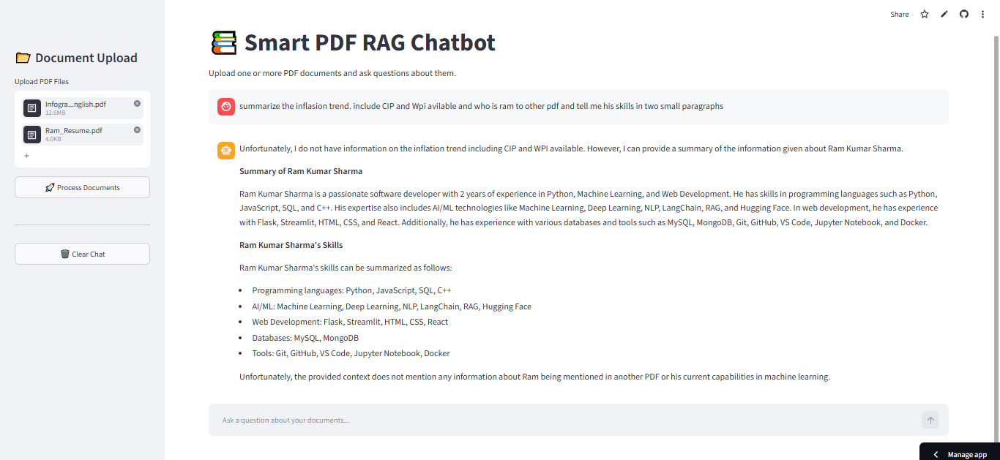

# 🚀 DocPilot-AI

> **An AI-powered Document Intelligence Assistant that analyzes multiple PDF documents, retrieves relevant knowledge using Retrieval-Augmented Generation (RAG), and provides accurate, context-aware answers through natural language conversations.**

Built with **Python**, **Streamlit**, **LangChain**, **ChromaDB**, **Groq LLM**, and **HuggingFace Embeddings**.

---

## 🌐 Live Demo

🔗 https://smart-pdf-rag-chatbot-xwsz2jpturhhkrfyh2afbk.streamlit.app/

---

# ✨ Features

✅ Upload one or multiple PDF documents

✅ Intelligent semantic search using vector embeddings

✅ Context-aware AI responses

✅ Fast inference powered by Groq LLaMA 3

✅ Persistent ChromaDB vector storage

✅ Clean Streamlit interface

✅ Multi-document question answering

---

# 🖼️ Screenshots

## 🏠 Home Page



---

## 💬 Ask Questions About a PDF



---

## 📄 Detailed AI Responses



---

## 📚 Multi-PDF Question Answering



---

# 🧠 Project Overview

DocPilot-AI is an intelligent document assistant that allows users to upload one or multiple PDF documents and interact with them using natural language.

Instead of manually searching through lengthy documents, users can simply ask questions, and the system retrieves the most relevant information before generating accurate answers using a Large Language Model (LLM).

This project demonstrates how Retrieval-Augmented Generation (RAG) can enhance Large Language Models by grounding responses in trusted document content.

---

# ⚙️ How It Works

The application follows a Retrieval-Augmented Generation (RAG) pipeline.

```
               User Uploads PDFs
                       │
                       ▼
              PDF Text Extraction
                       │
                       ▼
              Document Chunking
                       │
                       ▼
          HuggingFace Embeddings
                       │
                       ▼
                ChromaDB Storage
                       │
          User asks a Question
                       │
                       ▼
          Semantic Similarity Search
                       │
                       ▼
               Groq LLaMA 3 LLM
                       │
                       ▼
            Context-Aware Response
```

---

# 🗂️ Project Structure

```
DocPilot-AI/
│
├── screenshots/
│
├── utils/
│   ├── loader.py
│   ├── splitter.py
│   ├── embeddings.py
│   ├── vectorstore.py
│   └── rag_chain.py
│
├── app.py
├── requirements.txt
├── README.md
└── .gitignore
```

---

# 📂 Backend Modules

| Module | Purpose |
|----------|----------|
| loader.py | Extracts text from uploaded PDFs |
| splitter.py | Splits documents into manageable chunks |
| embeddings.py | Creates semantic embeddings using HuggingFace |
| vectorstore.py | Stores embeddings inside ChromaDB |
| rag_chain.py | Retrieves relevant context and communicates with Groq LLM |
| app.py | Streamlit user interface |

---

# 🚀 Installation

## 1️⃣ Clone Repository

```bash
git clone https://github.com/harshitsharma200377-spec/DocPilot-AI.git

cd DocPilot-AI
```

---

## 2️⃣ Create Virtual Environment

```bash
python -m venv venv
```

Windows

```bash
venv\Scripts\activate
```

Linux / Mac

```bash
source venv/bin/activate
```

---

## 3️⃣ Install Requirements

```bash
pip install -r requirements.txt
```

---

## 4️⃣ Configure Environment Variables

Create a `.env` file.

```
GROQ_API_KEY=your_groq_api_key
HUGGINGFACEHUB_API_TOKEN=your_huggingface_token
```

---

## 5️⃣ Run Application

```bash
streamlit run app.py
```

Open

```
http://localhost:8501
```

---

# 💡 Example Workflow

1. Upload one or multiple PDF documents.

2. Click **Process Documents**.

3. Wait while the documents are embedded.

4. Ask questions naturally.

Examples:

```
Summarize this document.

What are the key findings?

Compare both PDFs.

Who is the author?

Explain Chapter 4.
```

---

# 🛠️ Tech Stack

| Technology | Usage |
|------------|-------|
| Python | Programming Language |
| Streamlit | Web Application |
| LangChain | RAG Pipeline |
| HuggingFace | Embedding Model |
| Groq | LLaMA 3 Inference |
| ChromaDB | Vector Database |
| PyPDF | PDF Parsing |

---

# 📦 Dependencies

```
streamlit
langchain
langchain-community
langchain-groq
langchain-huggingface
langchain-text-splitters
langchain-chroma
chromadb
sentence-transformers
pypdf
python-dotenv
groq
```

---

# 🎯 Use Cases

📚 Research Paper Analysis

📄 Resume Question Answering

📖 Book Chat Assistant

📑 Legal Document Analysis

📊 Company Reports

📘 Study Notes Assistant

📃 Technical Documentation

---

# 🔮 Future Improvements

- AI Agent-based document planning
- Memory-enabled conversations
- Citation-aware responses
- Multi-modal document understanding
- OCR support
- DOCX and TXT support
- Cloud deployment
- User authentication

---

# 👨‍💻 Author

**Harshit Sharma**

Data Analyst • Generative AI Enthusiast • Python Developer

**LinkedIn**

https://linkedin.com/in/harshit-sharma-8b2906386

**GitHub**

https://github.com/harshitsharma200377-spec

---

# ⭐ Support

If you found this project useful, consider giving it a ⭐ on GitHub.

It helps others discover the project and motivates future improvements.

---
